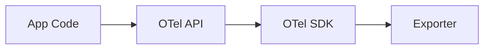

# API vs SDK

## What It Is
- **API**: The interface your code calls (`Tracer`, `Meter`, `Logger`). No implementation, no overhead.
- **SDK**: The implementation that records, batches, samples, and exports telemetry. Configurable.

## Why It Exists
Separating the interface from the implementation means application code depends only on a stable API, while the SDK can be swapped/upgraded independently — including being injected at runtime (auto-instrumentation).

## Architecture


## Key Features
- API is tiny and stable
- SDK provides batching, sampling, resource detection, processors
- SDK can be provided by a different package than the API

## When to Use It
- App developers depend on the API only
- Operators configure the SDK (sampler, exporter, resource)

## Code Example (Go)
```go
import (
  "go.opentelemetry.io/otel"            // API
  "go.opentelemetry.io/otel/sdk"        // SDK
)
tracer := otel.Tracer("my/pkg") // API; backed by configured SDK
```

## Best Practices
- Never depend on SDK internals in app code
- Configure SDK once at process startup
- Use auto-instrumentation to provide the SDK without code changes

## Related Concepts
- [Instrumentation](instrumentation.md)
- [Auto-Instrumentation](auto-instrumentation.md)
- [Exporter](exporter.md)
