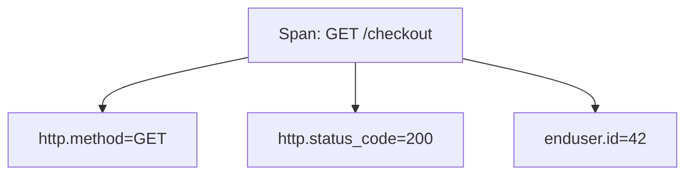

# Attributes

## What It Is
**Attributes** are **key-value pairs** attached to spans, metrics, logs, and resources that add context and enable filtering, grouping, and correlation.

## Why It Exists
Raw telemetry ("a span happened") is useless without context ("a span for `GET /checkout` from user 42 on host node-7"). Attributes carry that context.

## Types
- **Primitive values**: string, boolean, int, double
- **Arrays**: list of the above
- Attribute **keys** follow semantic-convention namespaces (`http.*`, `db.*`, `k8s.*`)

## Architecture


## When to Use It
- Add business context (user id, tenant)
- Add technical context (http route, db statement)
- **Never** put PII/secrets in attributes by default

## Code Example (Java)
```java
span.setAttribute("http.method", "GET");
span.setAttribute("http.route", "/checkout/{id}");
span.setAttribute("enduser.id", userId);
```

## Best Practices
- Use semantic conventions for standard keys
- Keep attribute cardinality bounded (avoid raw user IDs at high volume)
- Redact secrets; consider a filtering processor in the Collector

## Common Issues & Solutions
| Issue | Fix |
|-------|-----|
| Cardinality explosion | Move to span events or sample |
| Leaked secrets | Collector `attributes` processor to redact |
| Inconsistent names | Adopt semantic conventions |

## Related Concepts
- [Resource](resource.md)
- [Semantic Conventions](../11-semantic-conventions/README.md)
- [Collector Processors](../06-collector/processors-deep.md)
