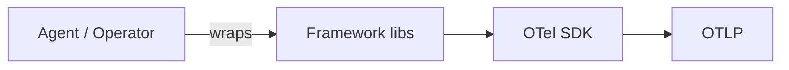

# Auto-Instrumentation (Zero-Code)

## What It Is
**Auto-instrumentation** captures telemetry **without changing application source code** by injecting an agent (bytecode manipulation, eBPF, or wrapper) that wraps supported libraries and frameworks.

## Why It Exists
Manual instrumentation is slow and incomplete. Auto-instrumentation gives immediate, broad coverage (HTTP servers, DB clients, queues) with zero code edits.

## Language Support
| Language | Mechanism |
|----------|-----------|
| Java | `-javaagent:opentelemetry-javaagent.jar` |
| Python | `opentelemetry-instrument` wrapper |
| Node.js | `-r @opentelemetry/instrumentation` |
| .NET | `OpenTelemetry.AutoInstrumentation` |
| Go | eBPF / code-based (limited auto) |
| Kubernetes | OTel Operator `Instrumentation` CRD |

## Architecture


## When to Use It
- Greenfield onboarding, fast time-to-value
- Covering many services uniformly
- Teams without bandwidth for manual spans

## Code Example
```bash
# Python
opentelemetry-instrument python app.py

# Java
java -javaagent:opentelemetry-javaagent.jar \
     -Dotel.service.name=checkout -jar app.jar

# Kubernetes (Operator)
kubectl annotate deployment/checkout \
  instrumentation.opentelemetry.io/inject-java=enabled
```

## Best Practices
- Prefer auto for breadth, add manual for key flows
- Pin agent versions; upgrade deliberately
- Use the OTel Operator in Kubernetes for consistent injection

## Common Issues & Solutions
| Issue | Fix |
|-------|-----|
| Conflict with other agents (e.g., APM) | Remove the other agent |
| Missing library support | Add manual instrumentation |
| Overhead | Enable sampling |

## Related Concepts
- [Instrumentation](instrumentation.md)
- [Kubernetes Deployment](../13-kubernetes-deployment/README.md)
- [Collector](../06-collector/README.md)
