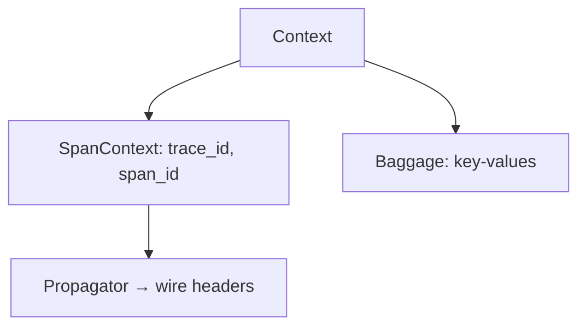

# Context

## What It Is
**Context** is the mechanism that carries **active state** (the current span, baggage, and other values) across function calls and across process boundaries during a request's lifetime.

## Why It Exists
In async and concurrent code, you cannot rely on globals or thread-locals alone. Context provides a propagation-aware carrier so the "current span" follows the request wherever it goes.

## Key Ideas
- **SpanContext**: identifies the current trace/span
- **Context propagation**: moves SpanContext + Baggage across services (see [Context Propagation](../07-context-propagation/README.md))
- **Active span**: `tracer.start_as_current_span` sets context

## Architecture


## When to Use It
- Passing the active span through async callbacks
- Carrying baggage (e.g., tenant id) across services
- Implementing custom propagators

## Code Example (Python)
```python
from opentelemetry import trace
from opentelemetry.context import attach, detach, get_value

ctx = trace.get_current_span().get_span_context()
token = attach(ctx)
try:
    ...  # work in this context
finally:
    detach(token)
```

## Best Practices
- Always pass context explicitly in async code
- Don't store spans in globals
- Use baggage sparingly (it propagates on every request)

## Related Concepts
- [Context Propagation](../07-context-propagation/README.md)
- [Traces](../03-traces/README.md)
- [Baggage](../07-context-propagation/baggage.md)
