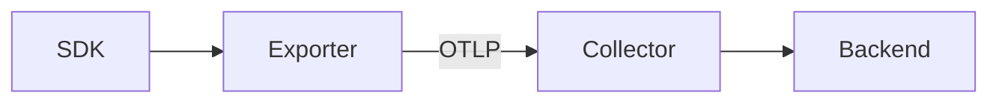

# Exporter

## What It Is
An **Exporter** is the SDK/Collector component that **sends telemetry** to a destination — typically a Collector (via OTLP) or a backend directly.

## Why It Exists
The SDK records data; exporters move it out. Pluggable exporters are what make OTel vendor-neutral.

## Exporter Categories
| Category | Examples |
|----------|----------|
| **Standard (OTLP)** | OTLP/gRPC, OTLP/HTTP |
| **Backend-specific** | Jaeger, Prometheus, Zipkin |
| **Logging** | Stdout, file (useful for debugging) |
| **Collector-side** | far more (see Collector exporters) |

## Architecture


## When to Use It
- App → Collector: always OTLP exporter
- App → backend directly: only for simple setups (dev)
- Collector → backend: Collector exporter

## Code Example (env)
```bash
OTEL_EXPORTER_OTLP_ENDPOINT=http://collector:4317
OTEL_EXPORTER_OTLP_PROTOCOL=grpc
```

## Best Practices
- In production, export to a **Collector**, not directly to many backends
- Use OTLP as the universal transport
- Configure retry/timeout on exporters (handled by SDK/Collector)

## Common Issues & Solutions
| Issue | Fix |
|-------|-----|
| Data loss on backend outage | Export to Collector with buffering |
| High fan-out | Centralize exporters in the Collector |

## Related Concepts
- [OTLP](otlp.md)
- [Collector](../06-collector/README.md)
- [Exporters & Backends](../10-exporters-backends/README.md)
