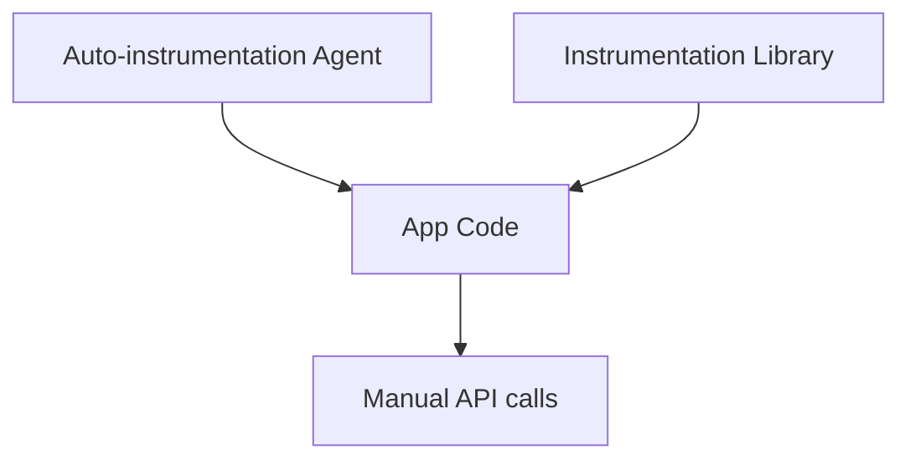

# Instrumentation

## What It Is
**Instrumentation** is the act of adding code (or agents) that captures telemetry from your application. OpenTelemetry supports **manual** (you write it) and **automatic** (injected) instrumentation.

## Why It Exists
You cannot observe what you do not measure. Instrumentation turns application behavior into OTel signals.

## Types
| Type | Description | Effort |
|------|-------------|--------|
| **Manual** | Call the API directly in your code | High, precise |
| **Auto / Zero-code** | Agent/library wraps frameworks automatically | Low |
| **Library** | Prebuilt instrumentation for a lib (e.g., SQLAlchemy) | Medium |

## Architecture


## When to Use It
- **Manual**: business metrics, custom spans, critical paths
- **Auto**: fast coverage of HTTP, DB, messaging libraries
- **Library**: standard frameworks (web, ORM, queue)

## Code Example (manual, Python)
```python
from opentelemetry import trace
tracer = trace.get_tracer("myapp")
with tracer.start_as_current_span("process_order") as span:
    span.set_attribute("order.id", order_id)
    ...
```

## Best Practices
- Start with auto-instrumentation for breadth
- Add manual spans for business-critical flows
- Combine: auto for frameworks, manual for domain logic

## Related Concepts
- [Auto-Instrumentation](auto-instrumentation.md)
- [API vs SDK](api-vs-sdk.md)
- [Language SDKs](../09-language-sdks/README.md)
