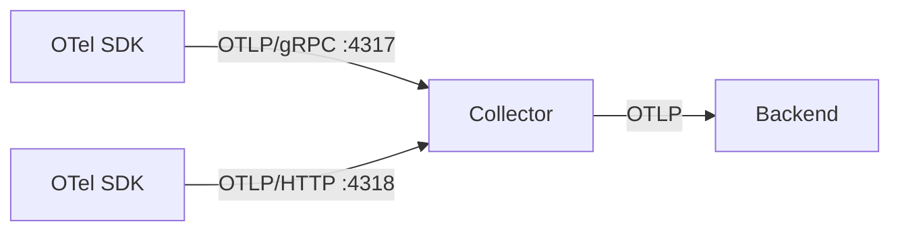

# OTLP — OpenTelemetry Protocol

## What It Is
**OTLP** (OpenTelemetry Protocol) is the **standard wire protocol** used to transmit telemetry between OTel components (SDKs ↔ Collector ↔ backends) over gRPC or HTTP.

## Why It Exists
A common protocol means any SDK can talk to any Collector or backend that speaks OTLP — eliminating per-vendor transport code.

## Key Features
- Two transports: **OTLP/gRPC** (port 4317) and **OTLP/HTTP** (port 4318)
- Serialization: **Protobuf** (primary), JSON (HTTP only)
- Carries traces, metrics, logs, and profiles in unified services
- Defines `Export*` request/response messages

## Architecture


## When to Use It
- Default choice for all OTel data transport
- Between SDK and Collector
- Between Collector and OTLP-native backends (Tempo, Jaeger, etc.)

## Code Example (env)
```bash
OTEL_EXPORTER_OTLP_ENDPOINT=http://collector:4317
OTEL_EXPORTER_OTLP_PROTOCOL=grpc   # or http/protobuf
```

## Best Practices
- Prefer gRPC inside clusters, HTTP at edges/firewalls
- Terminate TLS at the Collector or a gateway
- Use OTLP exclusively; avoid bespoke exporters where possible

## Common Issues & Solutions
| Issue | Fix |
|-------|-----|
| Port mismatch | gRPC=4317, HTTP=4318 |
| JSON over gRPC | Use Protobuf for gRPC |
| Proxy blocking | Use OTLP/HTTP with standard ports |

## Related Concepts
- [Collector](../06-collector/README.md)
- [Exporter](exporter.md)
- [Telemetry Data Model](telemetry-data-model.md)
