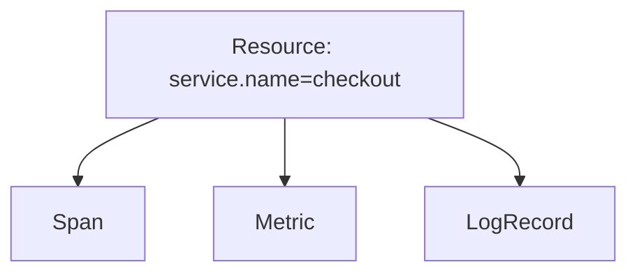

# Resource

## What It Is
A **Resource** describes the **entity producing telemetry** — typically a service, host, container, or process. It is attached to every signal emitted by that entity.

## Why It Exists
Without a Resource you cannot tell *which service or host* generated a span/metric/log. Resources provide the stable identity for grouping and filtering.

## Required & Common Attributes
| Attribute | Example | Required |
|-----------|---------|----------|
| `service.name` | `"checkout"` | Yes (recommended) |
| `service.version` | `"1.2.3"` | No |
| `service.namespace` | `"payments"` | No |
| `host.name` | `"node-7"` | Often |
| `cloud.provider` | `"aws"` | Often |
| `deployment.environment` | `"production"` | No |

## Architecture


## When to Use It
- Always: set `service.name`
- Set `deployment.environment` to separate prod/staging
- Use `telemetry.sdk.*` (auto-added) for SDK identification

## Code Example (Python)
```python
from opentelemetry.sdk.resources import Resource
from opentelemetry.semconv.resource import ResourceAttributes
resource = Resource.create({
    ResourceAttributes.SERVICE_NAME: "checkout",
    ResourceAttributes.DEPLOYMENT_ENVIRONMENT: "production",
})
```

## Best Practices
- Detect Resource from environment automatically where possible
- Keep Resource attributes low-cardinality and stable
- Never put request-specific data in Resource

## Common Issues & Solutions
| Issue | Fix |
|-------|-----|
| Missing service.name | Set via `OTEL_SERVICE_NAME` or resource detector |
| High cardinality in Resource | Move to span attributes |

## Related Concepts
- [Attributes](attributes.md)
- [Semantic Conventions](../11-semantic-conventions/README.md)
- [Telemetry Data Model](telemetry-data-model.md)
