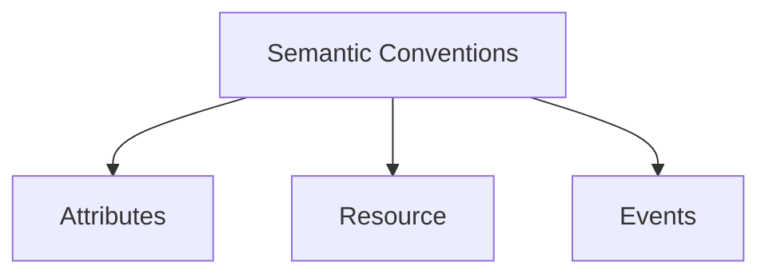

# Semantic Conventions

## What It Is
**Semantic Conventions** are **standardized attribute names and value formats** (e.g., `http.method`, `db.system`, `service.name`) shared across all languages and backends.

## Why It Exists
Without standards, every team names attributes differently (`http_status` vs `status_code` vs `http.code`), making data incomparable and dashboards brittle. Semantic conventions create a common vocabulary.

## Namespaces
| Namespace | Domain |
|-----------|--------|
| `service.*`, `deployment.*` | Resource |
| `http.*` | HTTP client/server |
| `db.*` | Databases |
| `messaging.*` | Queues/streams |
| `rpc.*` | RPC |
| `k8s.*`, `cloud.*`, `host.*` | Infra |
| `exception.*` | Errors |
| `url.*`, `enduser.*`, `user.*` | Request/user |

## Architecture


## When to Use It
- Always, for any standard attribute
- Extend (don't replace) with domain-specific keys

## Code Example (Python)
```python
from opentelemetry.semconv.trace import SpanAttributes
span.set_attribute(SpanAttributes.HTTP_METHOD, "GET")
span.set_attribute(SpanAttributes.HTTP_ROUTE, "/checkout")
```

## Best Practices
- Use the semconv library constants, not raw strings
- Don't invent `http.*` variants — follow the spec
- Watch the stability of conventions (some are experimental)

## Related Concepts
- [Attributes](attributes.md)
- [Semantic Conventions Section](../11-semantic-conventions/README.md)
- [Resource](resource.md)
