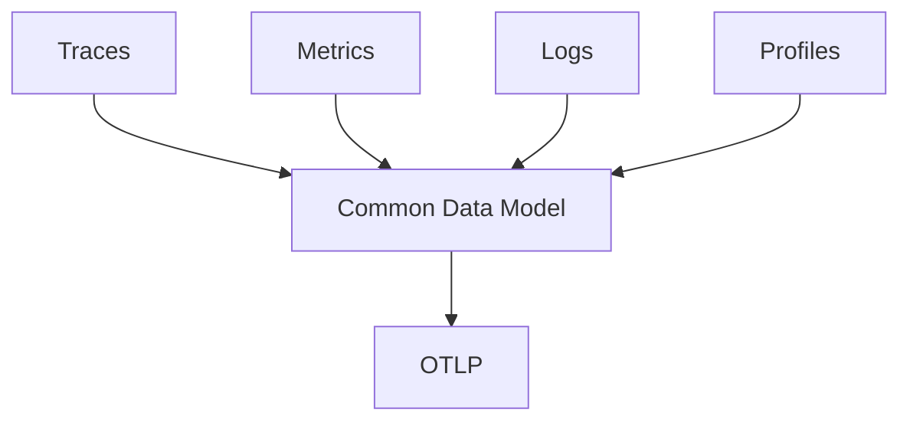

# Signals

## What It Is
A **signal** is a distinct kind of telemetry data in OpenTelemetry. OTel standardizes four: **Traces, Metrics, Logs, and Profiles**.

## Why It Exists
Different questions need different data shapes. A trace shows a request's path; a metric shows a rate over time; a log shows an event; a profile shows where CPU/time is spent.

## The Four Signals
| Signal | Answers | Status |
|--------|---------|--------|
| **Traces** | "What happened for this request?" | Stable (v1.0) |
| **Metrics** | "How is the system behaving over time?" | Stable (v1.0) |
| **Logs** | "What discrete events occurred?" | Stable (v1.0) |
| **Profiles** | "Where is CPU/memory spent?" | Experimental / emerging |

## Architecture

## When to Use Each
- **Traces**: distributed request flow, latency breakdowns
- **Metrics**: SLOs, dashboards, alerting on aggregates
- **Logs**: audit, errors, detailed event context
- **Profiles**: performance tuning, flamegraphs

## Best Practices
- Use traces for flow, metrics for alerts, logs for detail
- Link logs to traces via `trace_id`/`span_id`
- Keep metrics low-cardinality; keep traces/logs high-cardinality

## Related Concepts
- [Traces](../03-traces/README.md)
- [Metrics](../04-metrics/README.md)
- [Logs](../05-logs/README.md)
- [Profiling](../12-profiling/README.md)
