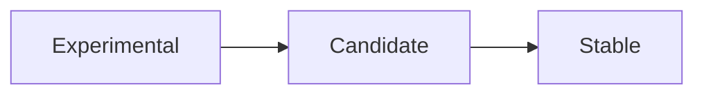

# Stability Levels

## What It Is
OpenTelemetry assigns **stability levels** to APIs, SDKs, signals, and semantic conventions to communicate backward-compatibility guarantees.

## Why It Exists
As a fast-moving standard, OTel needs a clear contract: what is safe to depend on vs. what may change. Stability levels prevent breaking users unexpectedly.

## Levels
| Level | Guarantee |
|-------|-----------|
| **Stable** | Backward compatible; won't break in minor releases |
| **Candidate (RC)** | Feature-complete, pending stabilization |
| **Experimental** | May change; opt-in required (often `_` prefix or feature flags) |

## Signal Status (current)
- **Traces, Metrics, Logs**: Stable
- **Profiles**: Experimental
- Some semantic conventions remain experimental

## Architecture

## When to Use It
- Build production code on **Stable** APIs only
- Pin versions when using Experimental features
- Watch release notes for promotions/demotions

## Best Practices
- Gate experimental usage behind a flag
- Avoid depending on experimental semantic conventions in long-lived dashboards
- Upgrade SDKs to adopt stabilized features

## Related Concepts
- [Version & Stability (docs)](../docs/version-stability.md)
- [Semantic Conventions](semantic-conventions.md)
