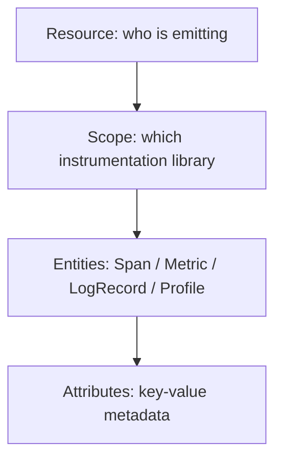

# Telemetry Data Model

## What It Is
The **Telemetry Data Model** is the shared, language-independent representation of OTel data: every signal is built from a small set of primitives (Resource, Scope, and the signal-specific entities).

## Why It Exists
A common model lets the same Collector pipeline process data from any language SDK and emit to any backend consistently.

## Core Primitives

| Primitive | Meaning |
|-----------|---------|
| **Resource** | The entity producing telemetry (service name, host, cloud) |
| **Scope (InstrumentationScope)** | The library/instrument that created the data |
| **Entity** | A Span, Metric, LogRecord, or Profile |
| **Attributes** | Key-value metadata attached to entities |

## When to Use It
- Designing custom exporters or processors
- Understanding how data maps across backends
- Building semantic-convention-aware tooling

## Best Practices
- Attach Resource attributes once (service.name is required)
- Keep Scope metadata accurate for version tracking
- Separate Resource (stable) from Span attributes (request-specific)

## Related Concepts
- [Resource](resource.md)
- [Attributes](attributes.md)
- [OTLP](otlp.md)
