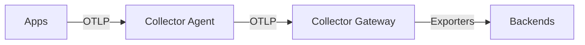

# 02 · Architecture

> How OpenTelemetry fits together: the **Collector pipeline** (receivers → processors → exporters, plus connectors and extensions), deployment topologies (agent vs gateway), and sampling strategies.

## Topics in this section

| Document | Summary |
|----------|---------|
| [collector-pipeline.md](collector-pipeline.md) | The receiver → processor → exporter model |
| [agent-vs-gateway.md](agent-vs-gateway.md) | Two standard deployment topologies |
| [receivers.md](receivers.md) | How data enters the Collector |
| [processors.md](processors.md) | Transform/filter/batch data in-flight |
| [exporters.md](exporters.md) | How data leaves the Collector |
| [connectors.md](connectors.md) | Consumers that also produce (e.g., spanmetrics) |
| [extensions.md](extensions.md) | Auxiliary functions (health, auth, storage) |
| [sampling.md](sampling.md) | Head/tail sampling to control volume |
| [deployment-modes.md](deployment-modes.md) |DaemonSet, Deployment, sidecar, Agent |

See the [main README](../README.md) for the full map.
