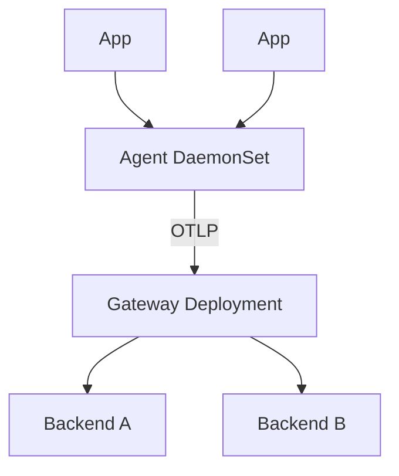

# Agent vs Gateway

## What It Is
Two standard Collector **deployment topologies**:
- **Agent**: a Collector co-located with workloads (sidecar or DaemonSet) that receives local telemetry and forwards it.
- **Gateway**: a centralized Collector that receives from many agents and exports to backends.

## Why It Exists
Agents minimize per-app config and provide local buffering; gateways centralize export, auth, and routing — together they scale and decouple cleanly.

## Architecture


## Key Features
- **Agent**: lightweight, `batch` + `memory_limiter`, tails logs, scrapes
- **Gateway**: heavy processing, auth, routing, tail sampling, exporters

## When to Use It
- Use **both** for production scale
- Agent-only is fine for small setups
- Gateway-only works if apps export OTLP directly

## Code Example
```yaml
# Agent: forward to gateway
exporters:
  otlp/gateway:
    endpoint: gateway.otel.svc:4317
```
```yaml
# Gateway: fan out to backends
exporters:
  otlp/jaeger: { endpoint: jaeger:4317 }
  prometheus: { endpoint: 0.0.0.0:8889 }
```

## Best Practices
- Put `memory_limiter` + `batch` on both tiers
- Authenticate agent→gateway (mTLS or token)
- Scale gateway horizontally behind a load balancer

## Related Concepts
- [Deployment Modes](deployment-modes.md)
- [Sampling](sampling.md)
- [Kubernetes Deployment](../13-kubernetes-deployment/README.md)
