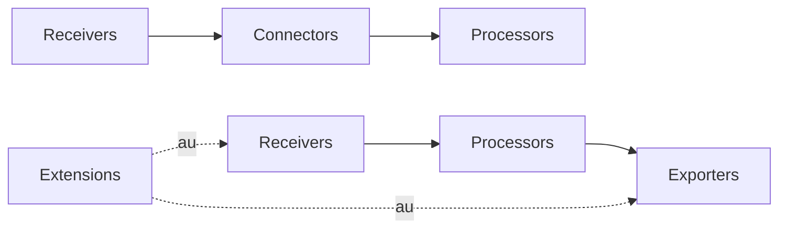

# Collector Pipeline

## What It Is
The **Collector pipeline** is the core processing model of the OpenTelemetry Collector: data flows **Receivers → Processors → Exporters**, with optional **Connectors** and **Extensions**.

## Why It Exists
Centralizing collection decouples applications from backends, enables uniform processing (batch, filter, redact, sample), and scales independently.

## Pipeline Model


## Key Features
- Composable, YAML-defined pipelines
- Per-signal pipelines (traces/metrics/logs)
- Pluggable components (100+ in the registry)
- Runs as agent, gateway, or both

## When to Use It
- Almost every production OTel deployment
- When you need to buffer, filter, or route telemetry centrally
- To switch backends without touching app code

## Code Example (minimal pipeline)
```yaml
receivers:
  otlp:
    protocols: { grpc: {}, http: {} }
processors:
  batch: {}
exporters:
  debug: {}
service:
  pipelines:
    traces:
      receivers: [otlp]
      processors: [batch]
      exporters: [debug]
```

## Best Practices
- Always include the `batch` processor
- Separate agent (light) and gateway (heavy) pipelines
- Use the `memory_limiter` processor to avoid OOM

## Common Issues & Solutions
| Issue | Fix |
|-------|-----|
| OOM | Add `memory_limiter` first in processors |
| High latency | Increase `batch` timeout/size |
| Pipeline not starting | Validate component references exist |

## Related Concepts
- [Receivers](receivers.md)
- [Processors](processors.md)
- [Exporters](exporters.md)
- [Sampling](sampling.md)
