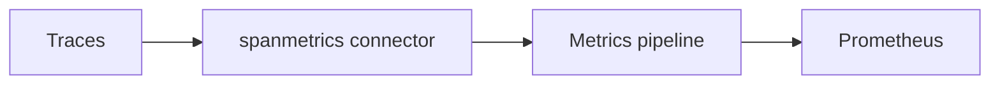

# Connectors

## What It Is
A **Connector** is a Collector component that **consumes one signal and produces another** (or the same), enabling signal-to-signal derivation within pipelines.

## Why It Exists
Some powerful patterns require converting between signals — e.g., generating metrics from traces (request rates, error rates, latency histograms) without re-instrumenting.

## Notable Connectors
| Connector | Derives |
|-----------|---------|
| `spanmetrics` | Metrics (RED) from traces |
| `servicegraph` | Service dependency graph from traces |
| `routing` | Route by attribute/type |
| `count` | Counts of records → metrics |
| `datadog` | Translate to Datadog format |

## Architecture


## When to Use It
- Generate SLI metrics from existing traces (no app changes)
- Build service maps from trace topology
- Route specific telemetry to different pipelines

## Code Example
```yaml
connectors:
  spanmetrics:
    histogram:
      explicit: { buckets: [0.05, 0.1, 0.25, 0.5, 1, 2.5, 5, 10] }
service:
  pipelines:
    traces:   { receivers: [otlp], exporters: [spanmetrics] }
    metrics:  { receivers: [spanmetrics], exporters: [prometheus] }
```

## Best Practices
- Use `spanmetrics` for instant RED dashboards
- Watch cardinality: dimensions like `http.route` can explode
- Place connectors between matching pipelines

## Related Concepts
- [Processors](processors.md)
- [Metrics](../04-metrics/README.md)
- [Observability Practice](../14-observability-practice/README.md)
