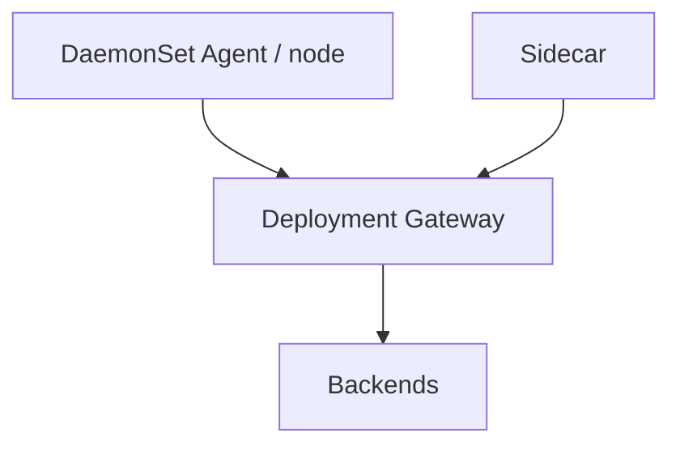

# Deployment Modes

## What It Is
The Collector can run in several **deployment modes**, depending on where it runs relative to your workloads.

## Why It Exists
Different environments (bare metal, Kubernetes, serverless, edge) need different placement for performance, security, and operability.

## Modes
| Mode | Placement | Use |
|------|-----------|-----|
| **DaemonSet (agent)** | One per node | Local receive, host metrics, log tail |
| **Deployment (gateway)** | Centralized, replicated | Export, routing, tail sampling |
| **Sidecar** | Next to each pod | Strong isolation, multi-tenant |
| **Agent process** | On VM/host | Single-host collection |
| **Serverless/container** | Per function or shared | Limited; export directly often |

## Architecture


## When to Use It
- Kubernetes: DaemonSet agent + Deployment gateway
- Strict isolation/tenancy: sidecars
- VMs: agent process forwarding to gateway

## Code Example (k8s)
```yaml
# DaemonSet for agent, Deployment for gateway
kubectl apply -f https://.../opentelemetry-operator.yaml
```
(See [Kubernetes Deployment](../13-kubernetes-deployment/README.md).)

## Best Practices
- Scale gateway with HPA on CPU/queue size
- Secure agent→gateway transport
- Avoid sidecars unless tenancy requires it (cost)

## Related Concepts
- [Agent vs Gateway](agent-vs-gateway.md)
- [Kubernetes Deployment](../13-kubernetes-deployment/README.md)
