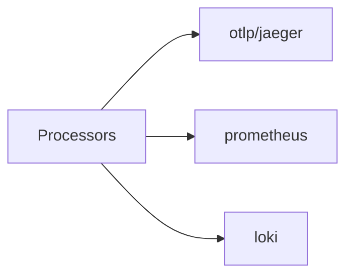

# Exporters

## What It Is
An **Exporter** is how telemetry **leaves** the Collector — to a backend, another Collector, or stdout.

## Why It Exists
Exporters decouple the Collector from destinations; you can change or add backends by editing Collector config only.

## Common Exporters
| Exporter | Destination |
|----------|-------------|
| `otlp` | Another Collector or OTLP backend |
| `debug` | Logs to stdout (dev/troubleshooting) |
| `prometheus` | Prometheus scrape endpoint |
| `logging` | Logs telemetry as text |
| `otlp/jaeger`, `otlp/tempo` | Tracing backends |
| `loki` | Logs backend |
| Vendor exporters | Datadog, New Relic, Honeycomb, etc. |

## Architecture


## When to Use It
- Export to a **gateway** Collector, then to backends
- Use `debug`/`logging` for validation
- Fan out to multiple backends as needed

## Code Example
```yaml
exporters:
  debug: { verbosity: detailed }
  otlp/jaeger:
    endpoint: jaeger-collector:4317
  prometheus:
    endpoint: 0.0.0.0:8889
service:
  pipelines:
    traces: { receivers: [otlp], processors: [batch], exporters: [debug, otlp/jaeger] }
```

## Best Practices
- Centralize exporters in the gateway
- Use `otlp` between tiers; backend-specific at the edge
- Configure retry/queue (built into many exporters)

## Related Concepts
- [Receivers](receivers.md)
- [Exporters & Backends](../10-exporters-backends/README.md)
