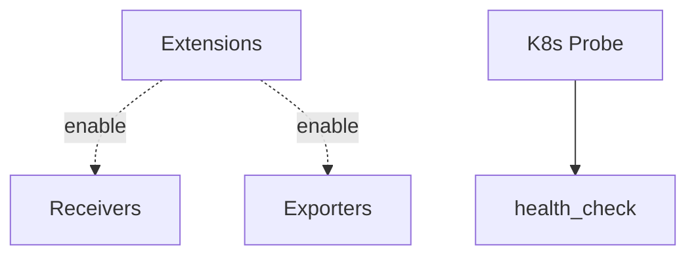

# Extensions

## What It Is
**Extensions** provide **auxiliary functionality** to the Collector that is not part of the telemetry pipeline — health checks, auth, storage, and observability of the Collector itself.

## Why It Exists
The Collector needs to be operated: health endpoints for k8s probes, auth for secured receivers, and internal metrics for debugging.

## Common Extensions
| Extension | Purpose |
|-----------|---------|
| `health_check` | Liveness/readiness endpoints (`:13133`) |
| `pprof` | Profiling the Collector |
| `zpages` | In-process debugging UI |
| `basicauth` / `bearertokenauth` | Auth for receivers |
| `oidc` | OIDC auth |
| `file_storage` | On-disk state (for tail sampling/exporters) |
| `memory_ballast` (legacy) | Pre-allocate memory |

## Architecture


## When to Use It
- Always: `health_check` for k8s probes
- Secured ingest: `basicauth`/`oidc`
- `file_storage` for `tail_sampling` decision persistence

## Code Example
```yaml
extensions:
  health_check:
    endpoint: 0.0.0.0:13133
  basicauth/otlp:
    client_auth:
      users:
        - username: agent
          password: $AGENT_TOKEN
service:
  extensions: [health_check, basicauth/otlp]
```

## Best Practices
- Expose `health_check` only internally
- Protect public receivers with auth
- Use `file_storage` when tail sampling across restarts

## Related Concepts
- [Receivers](receivers.md)
- [Sampling](sampling.md)
