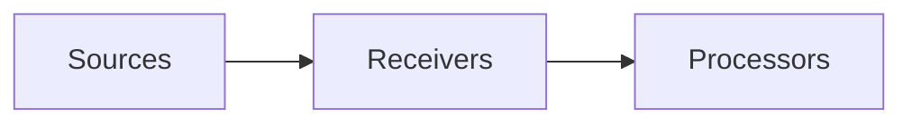

# Receivers

## What It Is
A **Receiver** is how telemetry **enters** the Collector. Receivers accept OTLP, scrape Prometheus, tail logs, read files, accept Zipkin/Jaeger, etc.

## Why It Exists
Data arrives in many formats and protocols. Receivers normalize all of them into the OTel data model.

## Common Receivers
| Receiver | Purpose |
|----------|---------|
| `otlp` | Receive OTLP (gRPC/HTTP) — primary |
| `prometheus` | Scrape Prometheus metrics |
| `jaeger` | Accept Jaeger thrift/grpc |
| `zipkin` | Accept Zipkin spans |
| `fluentforward` | Receive Fluentd logs |
| `filelog` | Tail log files |
| `hostmetrics` | Collect host CPU/mem/disk |

## Architecture


## When to Use It
- `otlp` for app telemetry
- `prometheus` to bridge existing scrape targets
- `hostmetrics`/`filelog` for infra/agent tiers

## Code Example
```yaml
receivers:
  otlp:
    protocols: { grpc: {}, http: {} }
  hostmetrics:
    collection_interval: 30s
    scrapers:
      cpu: {}
      memory: {}
```

## Best Practices
- Enable only the receivers you need
- Use `otlp` as the universal ingest
- Secure external receivers with auth extensions

## Related Concepts
- [Collector Pipeline](collector-pipeline.md)
- [Exporters](exporters.md)
