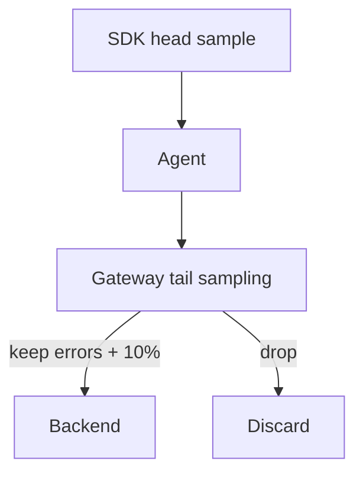

# Sampling

## What It Is
**Sampling** reduces the volume of telemetry by keeping only a fraction of it, while aiming to preserve the data you need for debugging and SLOs.

## Why It Exists
At scale, 100% collection is expensive and often unnecessary. Sampling cuts cost and storage while keeping representative (and error) data.

## Types
| Type | Where | Decision |
|------|-------|----------|
| **Head sampling** | SDK or `probabilistic_sampling` | Random at ingest (cheap) |
| **Tail sampling** | Collector gateway | After seeing whole trace (smart) |
| **Rate limiting** | Collector | Max records/sec |

## Architecture


## When to Use It
- **Head**: cheap default when volume is low
- **Tail**: keep all errors + slow requests, drop healthy noise
- Combine: head at SDK, tail at gateway

## Code Example (tail sampling)
```yaml
processors:
  tail_sampling:
    policies:
      - name: errors
        type: status_code
        status_code: { status_codes: [ERROR] }
      - name: slow
        type: latency
        latency: { threshold_ms: 500 }
      - name: probabilistic
        type: probabilistic
        probabilistic: { sampling_percentage: 10 }
```

## Best Practices
- Keep 100% of errors via tail sampling
- Set a fallback probabilistic policy (else unwanted drops)
- Head-sample at SDK to cut agent load

## Common Issues & Solutions
| Issue | Fix |
|-------|-----|
| Errors dropped | Add `status_code: ERROR` policy first |
| Inconsistent sampling | Order policies carefully |

## Related Concepts
- [Processors](processors.md)
- [Agent vs Gateway](agent-vs-gateway.md)
