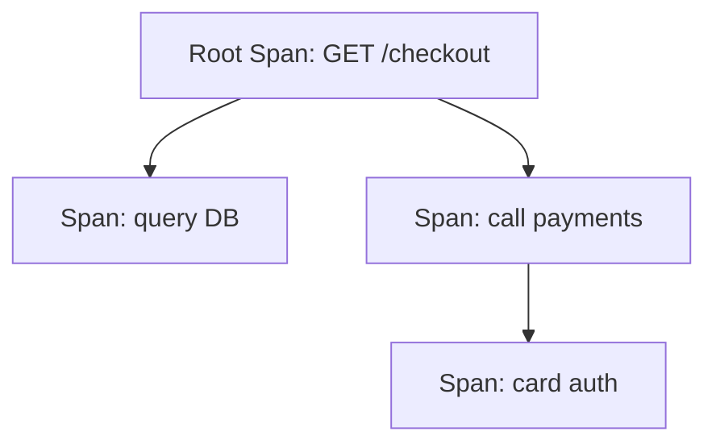

# 03 · Traces

> Traces represent the **journey of a request** through a distributed system. This section covers spans, the span context, parent/child relationships, attributes/events, links, status, and request correlation.

## Topics in this section

| Document | Summary |
|----------|---------|
| [span.md](span.md) | The unit of a trace: a single operation |
| [span-context.md](span-context.md) | trace_id, span_id, trace flags, state |
| [parent-child.md](parent-child.md) | Building span hierarchies |
| [attributes-and-events.md](attributes-and-events.md) | Adding context and time-stamped events |
| [links.md](links.md) | Connecting unrelated traces |
| [span-status.md](span-status.md) | OK / ERROR / UNSET |
| [distributed-tracing.md](distributed-tracing.md) | Following a request across services |
| [trace-id-correlation.md](trace-id-correlation.md) | Linking traces to logs/metrics |
| [context-propagation-traces.md](context-propagation-traces.md) | How context travels |
| [tracing-best-practices.md](tracing-best-practices.md) | Operational guidance |

See the [main README](../README.md) for the full map.
