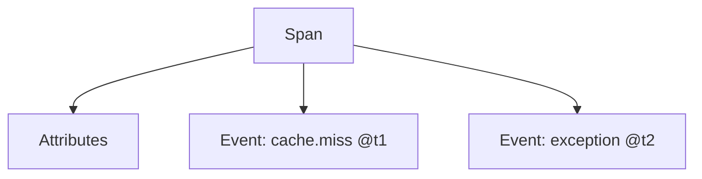

# Attributes & Events

## What It Is
- **Attributes**: key-value metadata on a span (e.g., `http.status_code`, `db.statement`).
- **Events**: timestamped sub-events within a span (e.g., "cache miss", an exception).

## Why It Exists
Attributes answer "what happened" statically; events capture "things that occurred at a moment in time" (like structured log lines inside a span).

## Attributes vs Events
| | Attributes | Events |
|--|-----------|--------|
| Shape | key-values | name + timestamp + attributes |
| Use | describe the operation | record discrete occurrences |
| Example | `http.route=/pay` | `exception` at t+12ms |

## Architecture


## When to Use It
- Attributes: request metadata, config, ids
- Events: exceptions, retries, state transitions

## Code Example (Java)
```java
span.addEvent("cache.miss", Attributes.of(stringKey("key"), "user:42"));
span.recordException(ex);
```

## Best Practices
- Keep attributes bounded in cardinality
- Use events for exceptions rather than many spans
- Prefer semantic-convention attribute keys

## Related Concepts
- [Attributes (core)](../01-core-concepts/attributes.md)
- [Span Status](span-status.md)
- [Semantic Conventions](../11-semantic-conventions/README.md)
