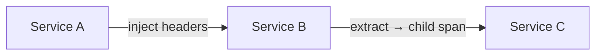

# Context Propagation in Traces

## What It Is
**Context propagation** is the mechanism that carries the active `SpanContext` (and baggage) across process and service boundaries via headers, so child spans attach correctly.

## Why It Exists
Without propagation, each service would start a new, unrelated trace. Propagation stitches spans into one distributed trace.

## Mechanism


- **Inject**: write context into outgoing headers (`traceparent`)
- **Extract**: read context from incoming headers → continue trace
- Handled automatically by instrumentation; manual for custom transports

## When to Use It
- Every outbound/inbound call (HTTP, gRPC, messaging)
- Custom protocols need manual inject/extract

## Code Example (manual, Python)
```python
from opentelemetry.propagate import inject, extract
headers = {}
inject(headers)                 # add traceparent
# send headers...
ctx = extract(incoming_headers) # on the other side
```

## Best Practices
- Use the W3C `traceparent` propagator by default
- Combine with `baggage` when you need custom values
- Don't disable propagation accidentally

## Related Concepts
- [Context Propagation (section)](../07-context-propagation/README.md)
- [Trace Context (W3C)](../07-context-propagation/trace-context.md)
- [Baggage](../07-context-propagation/baggage.md)
