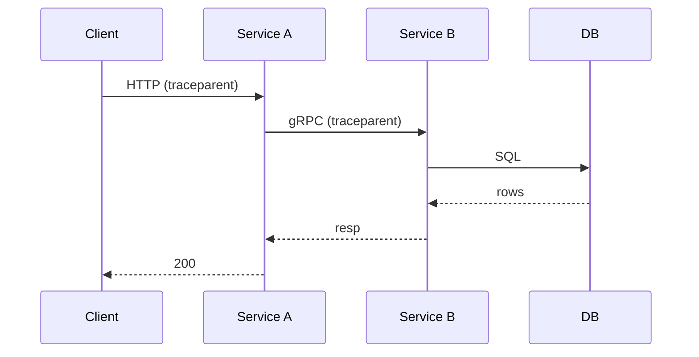

# Distributed Tracing

## What It Is
**Distributed tracing** follows a single request as it travels across multiple services, producing one **trace** composed of spans from each service.

## Why It Exists
Microservices make a request's path invisible in logs alone. Distributed tracing reveals latency, failures, and dependencies across service boundaries.

## Flow


## When to Use It
- Any system with >1 service
- Latency investigations, dependency mapping
- Error localization across teams

## Code Example
Propagation is automatic with OTel instrumentation:
```python
# Service A (server) and Service B (client) both instrumented
# traceparent header is injected/extracted automatically
requests.get("http://service-b/api",  # carries trace context
             headers=propagator.inject({}))
```

## Best Practices
- Instrument every hop (no gaps)
- Standardize on W3C trace context
- Correlate with logs via `trace_id`

## Common Issues & Solutions
| Issue | Fix |
|-------|-----|
| Broken trace across services | Ensure propagator configured |
| Missing spans | Check auto-instrumentation coverage |
| Async gaps | Pass context through callbacks |

## Related Concepts
- [Context Propagation](../07-context-propagation/README.md)
- [Trace ID Correlation](trace-id-correlation.md)
- [Service Graph (connector)](../02-architecture/connectors.md)
