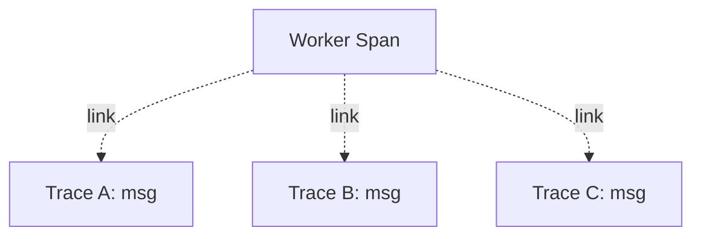

# Links

## What It Is
A **Link** connects a span to **one or more spans in other traces** (or the same trace), without making them parent/child.

## Why It Exists
Some relationships aren't hierarchical: a batch job processing many requests, or an async worker handling a message, links back to the originating traces without being a child.

## Architecture


## When to Use It
- Message/queue consumers processing producer traces
- Batch or aggregation jobs touching many traces
- Async workflows where parent context is lost

## Code Example (Python)
```python
from opentelemetry.trace import Link, SpanContext, TraceFlags
link = Link(producer_span_context)
with tracer.start_as_current_span("process", links=[link]) as span:
    ...
```

## Best Practices
- Use links instead of fake parentage for async
- Keep link counts low (they add overhead)
- Link at span creation time (cannot add later)

## Related Concepts
- [Parent/Child](parent-child.md)
- [Span Context](span-context.md)
- [Distributed Tracing](distributed-tracing.md)
