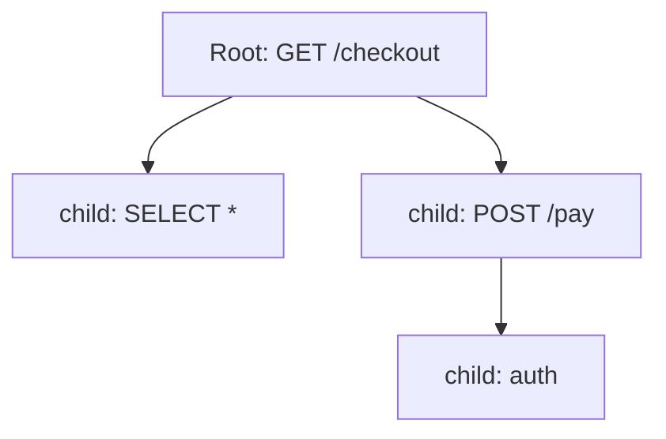

# Parent / Child Spans

## What It Is
Spans form a **hierarchy**: a **parent** span creates **child** spans for sub-operations. The root span has no parent. Together they form the trace tree.

## Why It Exists
Hierarchy shows causality — what caused what — and lets you attribute latency to specific sub-operations and services.

## Building Hierarchy


## Architecture Notes
- A child uses its parent's `SpanContext` (via Context)
- `span_kind` clarifies cross-service vs internal
- Orphan spans (lost parent) break the tree

## When to Use It
- Always nest DB/RPC calls under the request span
- Mark cross-service calls as `CLIENT`/`SERVER`

## Code Example (Python)
```python
with tracer.start_as_current_span("checkout") as parent:
    with tracer.start_as_current_span("charge_card") as child:
        ...  # child is nested under parent automatically
```

## Best Practices
- Avoid overly deep trees (cap nesting)
- Don't create spans for trivial operations
- Ensure context is passed in async code

## Common Issues & Solutions
| Issue | Fix |
|-------|-----|
| Flat trace (no nesting) | Pass context to child calls |
| Orphan spans | Propagate context across threads |

## Related Concepts
- [Span](span.md)
- [Span Context](span-context.md)
- [Links](links.md)
