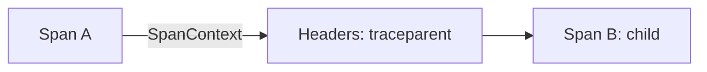

# Span Context

## What It Is
**SpanContext** is the portion of a span that must be propagated to relate spans: `trace_id`, `span_id`, **trace flags** (sampled?), and **trace state** (vendor info).

## Why It Exists
Child spans in other processes need to know their parent. SpanContext is the minimal, serializable identity carried across boundaries.

## Fields
| Field | Description |
|-------|-------------|
| `trace_id` | 16-byte ID for the whole trace |
| `span_id` | 8-byte ID for this span |
| `trace_flags` | e.g., `sampled` (01) |
| `trace_state` | W3C key-value list for vendors |

## Architecture


## When to Use It
- Implicitly via propagators (you rarely build it by hand)
- When implementing custom propagation

## Code Example (Python)
```python
ctx = span.get_span_context()
print(ctx.trace_id, ctx.span_id, ctx.trace_flags)
```

## Best Practices
- Never log full `trace_state` insecurely
- Respect the `sampled` flag in head sampling
- Rely on standard propagators, not manual headers

## Related Concepts
- [Context Propagation](../07-context-propagation/README.md)
- [Parent/Child](parent-child.md)
- [Trace Context (W3C)](../07-context-propagation/trace-context.md)
