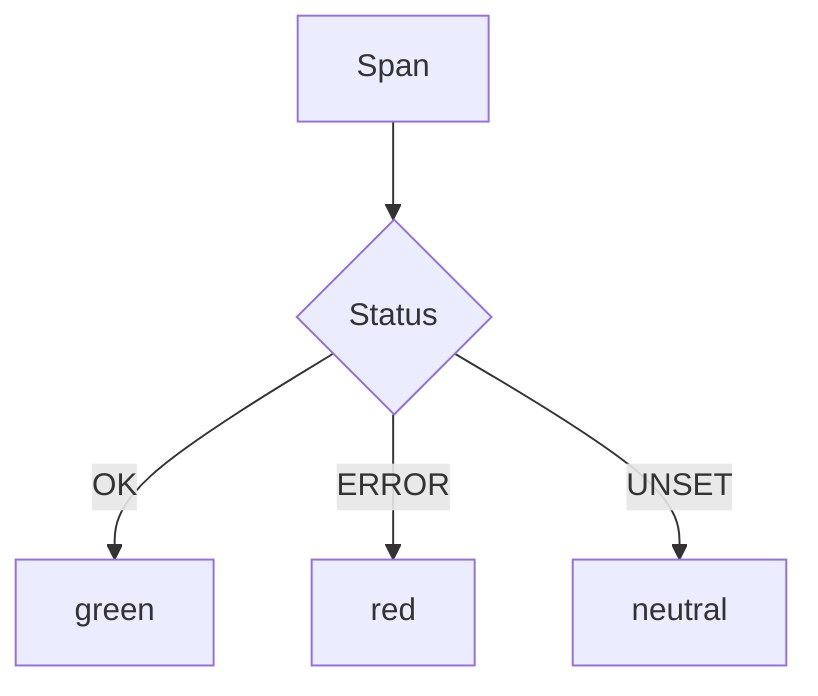

# Span Status

## What It Is
**Span Status** expresses the outcome of an operation: **UNSET** (default), **OK**, or **ERROR**.

## Why It Exists
Status is the standard signal backends use to compute error rates and to drive tail-sampling policies (e.g., "keep all ERROR spans").

## Values
| Status | Meaning |
|--------|---------|
| `UNSET` | No explicit status (treated as success-ish) |
| `OK` | Operation succeeded |
| `ERROR` | Operation failed (set with description) |

## Architecture


## When to Use It
- Set `ERROR` on caught exceptions
- Avoid setting `OK` on every span (UNSET is fine)
- Treat HTTP 5xx as ERROR, not 4xx (by convention)

## Code Example (Go)
```go
if err != nil {
    span.RecordError(err)
    span.SetStatus(codes.Error, "failed to charge card")
}
```

## Best Practices
- Pair `ERROR` status with `recordException`
- Don't mark client 4xx as span ERROR (it's expected)
- Use status in tail-sampling policies

## Related Concepts
- [Attributes & Events](attributes-and-events.md)
- [Sampling](../02-architecture/sampling.md)
