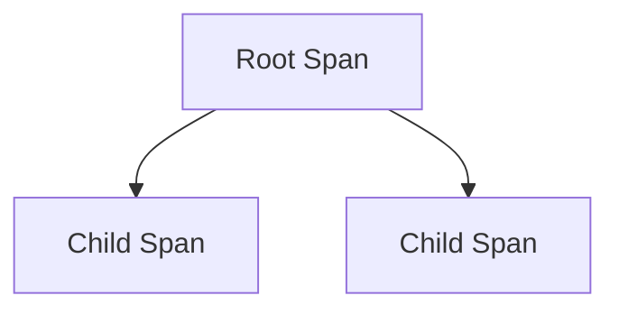

# Span

## What It Is
A **Span** represents a single **unit of work** or operation within a trace — e.g., an HTTP request, a DB query, or a function call. A **trace** is a tree (DAG) of spans.

## Why It Exists
Spans let you break a request into timed operations, measure each, and understand the path and latency contributors.

## Span Anatomy
| Field | Meaning |
|-------|---------|
| `trace_id` | Identifies the whole trace |
| `span_id` | Identifies this span |
| `parent_span_id` | Parent (null for root) |
| `name` | Operation name |
| `start/end` | Timestamps → duration |
| `attributes` | Metadata |
| `events` | Timestamped sub-events |
| `status` | OK / ERROR / UNSET |
| `links` | References to other traces |

## Architecture


## When to Use It
- Every meaningful operation (HTTP handler, DB call, RPC)
- External calls and internal sub-tasks

## Code Example (Go)
```go
ctx, span := tracer.Start(ctx, "queryUser")
defer span.End()
span.SetAttributes(attribute.String("user.id", id))
```

## Best Practices
- Name spans by operation, not by instance
- Keep spans short and meaningful (not per-line)
- Add `span_kind` (SERVER/CLIENT/INTERNAL)

## Related Concepts
- [Span Context](span-context.md)
- [Parent/Child](parent-child.md)
- [Distributed Tracing](distributed-tracing.md)
