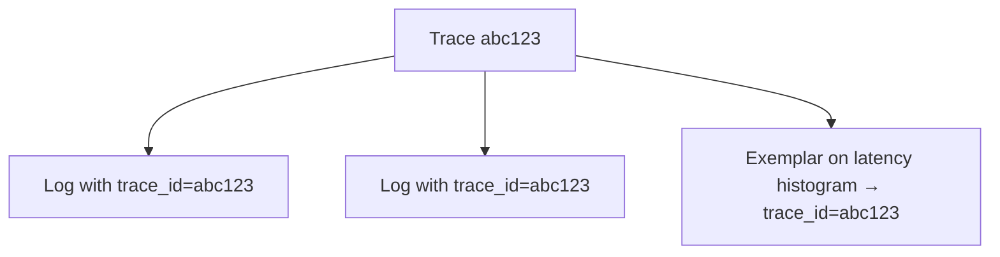

# Trace ID Correlation

## What It Is
**Trace ID correlation** links telemetry across signals — embedding `trace_id` (and `span_id`) into logs and exemplars so you can jump from a trace to the relevant logs and metrics.

## Why It Exists
A slow trace is only useful if you can read the log lines that occurred during it. Correlation connects the three pillars.

## How It Works


## When to Use It
- Always emit `trace_id` in structured logs
- Attach exemplars to metrics for "show me a trace at this spike"
- Build "click trace → see logs" in your UI

## Code Example (Python logging)
```python
from opentelemetry import trace
tid = trace.get_current_span().get_span_context().trace_id
logger.info("order processed", extra={"trace_id": format(tid, "032x")})
```

## Best Practices
- Use the standard `trace_id`/`span_id` field names
- Sample logs proportionally to traces to control volume
- Enable exemplars in Prometheus/OTel metrics

## Related Concepts
- [Logs](../05-logs/README.md)
- [Exemplars](../04-metrics/exemplars.md)
- [Distributed Tracing](distributed-tracing.md)
