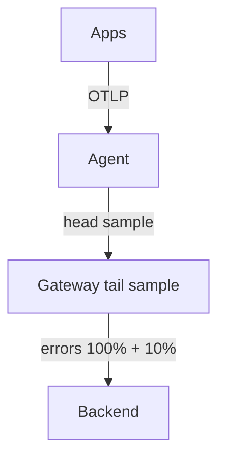

# Tracing Best Practices

## What It Is
Operational guidance for getting value from traces without drowning in cost or noise.

## Why It Exists
Naive tracing produces huge volumes, broken trees, and dashboards nobody uses. Good practices make traces actionable.

## Key Recommendations
- **Instrument every hop** so traces are continuous
- **Name spans by operation**, not instance (`GET /users` not `users-handler`)
- **Set `span_kind`** correctly (SERVER/CLIENT)
- **Add semantic attributes** (`http.route`, `db.system`)
- **Record exceptions** with status ERROR
- **Sample**: keep 100% errors + tail-sample the rest
- **Correlate** logs via `trace_id`

## Architecture (healthy pipeline)

## Common Pitfalls
| Pitfall | Fix |
|---------|-----|
| Full traces too costly | Tail sampling at gateway |
| Flat traces (no nesting) | Pass context properly |
| Cardinality explosion | Limit high-card attributes; sample |
| No logs correlation | Emit `trace_id` in logs |

## Related Concepts
- [Sampling](../02-architecture/sampling.md)
- [Span](span.md)
- [Trace ID Correlation](trace-id-correlation.md)
