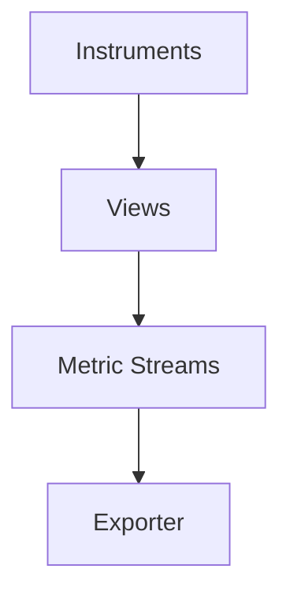

# 04 · Metrics

> Metrics are **aggregated measurements** over time. This section covers the instrument types (Counter, Gauge, Histogram, async), Views/aggregation, exemplars, and metric streams.

## Topics in this section

| Document | Summary |
|----------|---------|
| [counter.md](counter.md) | Monotonic & non-monotonic sums |
| [gauge.md](gauge.md) | Last-value measurements |
| [histogram.md](histogram.md) | Distribution of values (latency) |
| [async-instruments.md](async-instruments.md) | Observable/up-down callbacks |
| [views.md](views.md) | Customize instrument → stream |
| [aggregation.md](aggregation.md) | How data is aggregated |
| [exemplars.md](exemplars.md) | Link metrics to traces |
| [metric-streams.md](metric-streams.md) | Instrument → stream mapping |
| [metric-best-practices.md](metric-best-practices.md) | Naming, cardinality |
| [metric-stability.md](metric-stability.md) | Stable metrics API |

See the [main README](../README.md) for the full map.
