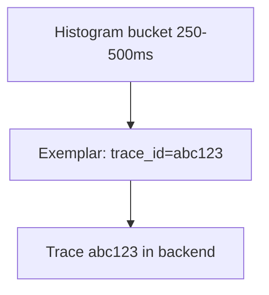

# Exemplars

## What It Is
An **Exemplar** is a recorded example (typically a `trace_id` + value + timestamp) attached to a metric data point, linking an aggregate back to an individual trace.

## Why It Exists
"A latency spike happened" is useful; "here is the actual trace that was slow at that moment" is actionable. Exemplars bridge metrics → traces.

## Architecture


## When to Use It
- Latency histograms (the classic case)
- Any metric where "show me an example" helps debugging

## Code Example (Go)
```go
opt := metric.WithExemplarReservoir(
    exemplar.NewTraceBasedReservoir())
histogram := meter.Float64Histogram("http.duration", opt)
```
(Python/Java expose exemplars automatically when trace context is active.)

## Best Practices
- Enable exemplars on latency histograms
- Ensure `trace_id` is present in the active context
- Use them in Grafana/Prometheus "click spike → trace"

## Related Concepts
- [Histogram](histogram.md)
- [Trace ID Correlation](../03-traces/trace-id-correlation.md)
- [Views](views.md)
