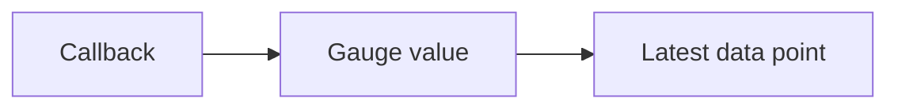

# Gauge

## What It Is
A **Gauge** captures the **current value** of something at measurement time (e.g., temperature, memory usage, queue size). Gauges are typically **asynchronous** (observed, not accumulated).

## Why It Exists
Some values aren't "counts over time" — they're instantaneous states you sample (CPU %, free memory).

## Variants
| Instrument | Notes |
|------------|-------|
| `Gauge` (async) | Last-value observation |
| `ObservableGauge` | Callback reports current value |

## Architecture


## When to Use It
- Resource utilization (CPU, memory, disk)
- Business state (inventory count, connection pool)

## Code Example (Go)
```go
meter.AsyncFloat64().Gauge("system.memory.usage").
    WithDescription("Memory in use").
    Observe(func(ctx context.Context, o metric.Float64Observer) error {
        o.Observe(currentMemoryBytes())
        return nil
    })
```

## Best Practices
- Use async instruments for sampled state
- Don't use Counters for state (use UpDownCounter/Gauge)
- Avoid high-cardinality dimensions

## Related Concepts
- [Async Instruments](async-instruments.md)
- [Counter](counter.md)
