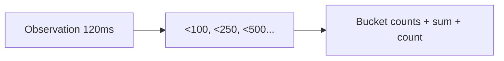

# Histogram

## What It Is
A **Histogram** records the **distribution of values** (e.g., request latency, payload size) by counting observations into buckets and tracking sum/count.

## Why It Exists
Averages hide tail latency. Histograms let you compute percentiles (p50/p95/p99), which matter for SLOs.

## Variants
| Instrument | Notes |
|------------|-------|
| `Histogram` (sync) | Explicit or explicit-base buckets |
| `GaugeHistogram` (async) | Distribution of a sampled state |

## Architecture


## When to Use It
- Latency of requests, DB calls, RPC
- Payload sizes, queue wait times

## Code Example (Python)
```python
latency = meter.create_histogram("http.server.duration", unit="ms")
latency.record(120.5, {"http.route": "/checkout"})
```

## Best Practices
- Choose bucket boundaries matching your SLO (e.g., 100/250/500/1000ms)
- Use exemplars to link a spike to a trace
- Avoid too many distinct attribute dimensions

## Related Concepts
- [Exemplars](exemplars.md)
- [Views](views.md)
- [Observability Practice (RED)](../14-observability-practice/README.md)
