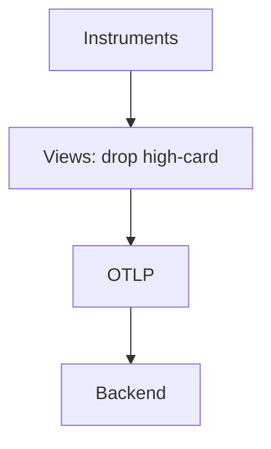

# Metric Best Practices

## What It Is
Guidance for instrumenting metrics that are cheap, queryable, and aligned with SLOs.

## Why It Exists
Bad metric design causes cardinality explosions, unusable dashboards, and surprise bills.

## Recommendations
- Use **Counters** for counts, **Histograms** for latency, **Gauges** for state
- Choose **bucket boundaries** that match SLO thresholds
- Keep **attribute cardinality bounded** (status, route — not user id)
- Enable **exemplars** on latency
- Use **Views** to drop high-card attributes centrally
- Name metrics consistently (noun_verb or system.unit)

## Architecture (healthy)

## Common Pitfalls
| Pitfall | Fix |
|---------|-----|
| Cardinality explosion | Remove user/request ids from metrics |
| Useless averages | Use histograms + percentiles |
| Missing SLO metrics | Define RED/USE first |

## Related Concepts
- [Cardinality & RED/USE](../14-observability-practice/README.md)
- [Views](views.md)
- [Exemplars](exemplars.md)
