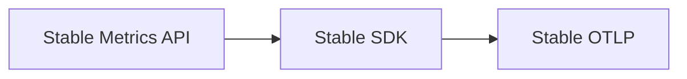

# Metric Stability

## What It Is
The OpenTelemetry **Metrics API/SDK is Stable** (since v1.0 of metrics), meaning backward-compatible guarantees for the instrument types and the metrics data model.

## Why It Exists
Stability lets teams build long-lived dashboards and alerts on OTel metrics without fear of breaking changes.

## Stable Components
- Synchronous: Counter, UpDownCounter, Histogram
- Asynchronous: ObservableCounter, ObservableUpDownCounter, ObservableGauge
- Views, Aggregation, Exemplars
- OTLP metrics wire format

## Architecture


## When to Use It
- Build production metrics on the stable instruments
- Create SLO dashboards/alerts confidently

## Code Example
```python
from opentelemetry.metrics import get_meter
meter = get_meter("my-service")  # stable since metrics GA
```

## Best Practices
- Pin SDK versions; upgrade for fixes
- Use semantic-convention metric names where available
- Validate pipelines with the `debug` exporter

## Related Concepts
- [Stability Levels (core)](../01-core-concepts/stability-levels.md)
- [Version & Stability (docs)](../docs/version-stability.md)
