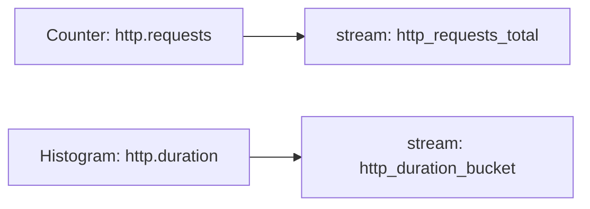

# Metric Streams

## What It Is
A **Metric Stream** is the exported time-series produced by an instrument after Views/aggregation are applied. One instrument can yield one stream (or be split by attributes).

## Why It Exists
The "stream" is the unit backends store and query. Understanding the mapping prevents cardinality surprises.

## Mapping


- Each unique **attribute set** = a distinct series within the stream
- High-cardinality attributes → many series → storage cost

## When to Use It
- Designing instruments and their attributes
- Estimating backend cost/cardinality

## Code Example (conceptual)
```
instrument: http.server.duration
attributes: {http.route, http.status_code}
→ streams: one time-series per (route, status_code) combination
```

## Best Practices
- Bound the number of attribute combinations
- Use Views to drop high-card attributes
- Prefer bounded enumerations (status codes) over unbounded ids

## Related Concepts
- [Views](views.md)
- [Attributes (core)](../01-core-concepts/attributes.md)
- [Metric Best Practices](metric-best-practices.md)
