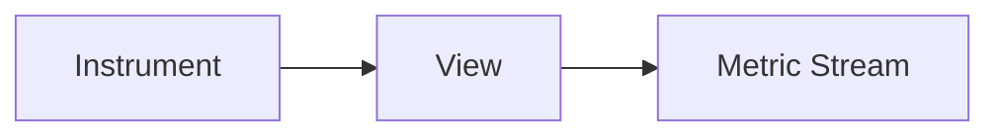

# Views

## What It Is
A **View** customizes how an instrument maps to a **metric stream** — renaming, changing aggregation, dropping attributes, or selecting which instruments to export.

## Why It Exists
You may want to change bucket sizes, drop a high-cardinality attribute, or rename a metric without touching instrumentation code.

## Capabilities
| Action | Purpose |
|--------|---------|
| Rename | Change exported metric name |
| Select instruments | Include/exclude by name/type |
| Aggregation | Switch to explicit histogram buckets |
| Attribute filter | Drop expensive attributes |

## Architecture


## When to Use It
- Tune histogram bucket boundaries for SLOs
- Drop `http.url` (high-card) → keep `http.route`
- Exclude noisy instruments from export

## Code Example (Go)
```go
view := metric.NewView(
    metric.Instrument{Name: "http.server.duration"},
    metric.Stream{Aggregation: metric.AggregationExplicitBucketHistogram{
        Boundaries: []float64{10, 25, 50, 100, 250, 500, 1000}}},
)
provider := metric.NewMeterProvider(metric.WithView(view))
```

## Best Practices
- Use Views to control cardinality at the SDK
- Prefer dropping attributes over sampling metrics
- Document custom Views for your team

## Related Concepts
- [Aggregation](aggregation.md)
- [Metric Streams](metric-streams.md)
- [Attributes (core)](../01-core-concepts/attributes.md)
