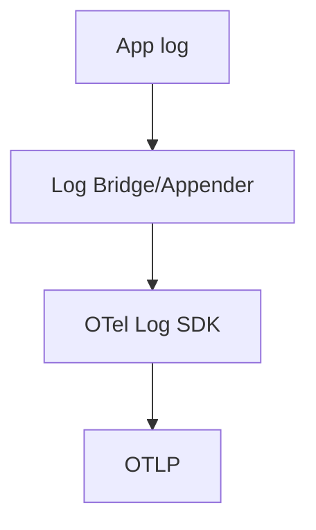

# 05 · Logs

> Logs are **time-stamped, discrete events** with severity and structured attributes. This section covers LogRecords, severity, the Log SDK, bridging existing logs, appenders, and correlation.

## Topics in this section

| Document | Summary |
|----------|---------|
| [log-record.md](log-record.md) | The unit of log telemetry |
| [severity.md](severity.md) | TRACE→FATAL severity numbers |
| [log-attributes.md](log-attributes.md) | Structured context on logs |
| [log-sdk.md](log-sdk.md) | Logger, emit, processors |
| [bridging.md](bridging.md) | Send existing logs to OTel |
| [log-appenders.md](log-appenders.md) | Framework integrations |
| [log-correlation.md](log-correlation.md) | Link logs to traces |
| [log-best-practices.md](log-best-practices.md) | Structured, sampled, safe |
| [log-stability.md](log-stability.md) | Logs API status |

See the [main README](../README.md) for the full map.
