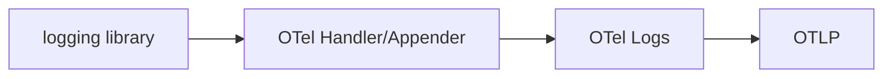

# Bridging

## What It Is
**Bridging** sends logs from existing logging frameworks (log4j, zap, python logging, logrus) into OpenTelemetry **without rewriting log statements**.

## Why It Exists
Most apps already log via a framework. Bridging captures that output as OTel LogRecords, including automatic trace correlation.

## Approaches
| Approach | Example |
|----------|---------|
| **Log handler/appender** | `LoggingHandler` for Python `logging` |
| **File tailing** | Collector `filelog` receiver |
| **Stdout** | Collector `k8sattributes` + container logs |
| **Log agent** | Fluent Bit → OTel |

## Architecture


## When to Use It
- Almost always for existing apps
- Prefer app-level bridge (keeps attributes) over file tailing

## Code Example (Python)
```python
import logging
from opentelemetry.sdk._logs import LoggingHandler
logging.getLogger().addHandler(LoggingHandler(level=logging.NOTSET, logger_provider=provider))
```

## Best Practices
- Bridge at the app for structured attributes + trace_id
- Use Collector `filelog` for legacy/file-only apps
- Parse severity and attributes from the bridge

## Related Concepts
- [Log Appenders](log-appenders.md)
- [Log Correlation](log-correlation.md)
- [Collector Receivers](../02-architecture/receivers.md)
