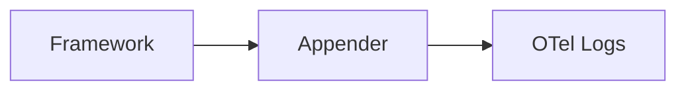

# Log Appenders

## What It Is
**Log appenders/handlers** are framework-specific adapters that forward a language's native logs into OpenTelemetry (e.g., Log4j2 appender, zap logger, `LoggingHandler`).

## Why It Exists
Each logging framework has its own extension point; appenders plug OTel in at that point, capturing records with minimal code change.

## Examples
| Framework | Adapter |
|-----------|---------|
| Python `logging` | `LoggingHandler` |
| Java Log4j2 | `opentelemetry-log4j-appender` |
| Go zap | `otelzap` / `logur` bridge |
| .NET | `OpenTelemetry.Logs` + `AddOpenTelemetry` |
| Node `winston`/`pino` | `@opentelemetry/instrumentation-*` |

## Architecture


## When to Use It
- Integrate OTel logs into an existing framework
- Capture framework-native context (logger name, level)

## Code Example (Java Log4j2)
```xml
<Appenders>
  <OpenTelemetry name="OpenTelemetry"/>
</Appenders>
<Loggers>
  <Root level="info"><AppenderRef ref="OpenTelemetry"/></Root>
</Loggers>
```

## Best Practices
- Prefer official appenders
- Ensure `trace_id` is injected (log4j has `TraceId` pattern)
- Batch at the SDK/Collector

## Related Concepts
- [Bridging](bridging.md)
- [Log SDK](log-sdk.md)
- [Language SDKs](../09-language-sdks/README.md)
