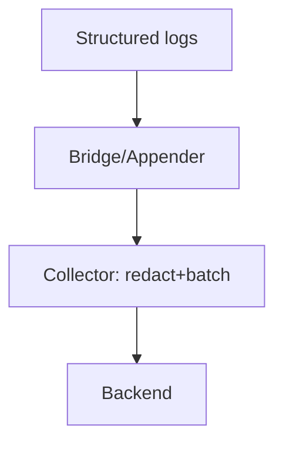

# Log Best Practices

## What It Is
Operational guidance for logs that are useful, queryable, and cost-controlled in OpenTelemetry.

## Why It Exists
Unstructured, high-volume, secret-leaking logs are a major observability cost and liability.

## Recommendations
- **Structure** logs with attributes, not stringly-typed bodies
- **Correlate** with `trace_id`/`span_id`
- **Sample** DEBUG/TRACE in production
- **Redact** secrets (Collector `attributes` processor)
- **Batch** via SDK/Collector
- **Use severity** correctly for filtering

## Architecture (healthy)

## Common Pitfalls
| Pitfall | Fix |
|---------|-----|
| Logs not linked to traces | Add `trace_id` via appender |
| Secret leakage | Redact in Collector |
| Cost explosion | Sample + drop noisy levels |

## Related Concepts
- [Bridging](bridging.md)
- [Log Correlation](log-correlation.md)
- [Troubleshooting](../15-troubleshooting/README.md)
