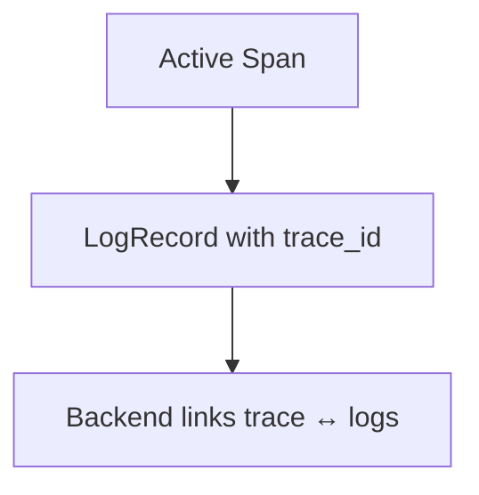

# Log Correlation

## What It Is
**Log correlation** attaches the active `trace_id` / `span_id` to log records so logs can be tied back to the trace that produced them.

## Why It Exists
When a trace shows a slow or failing request, you need the exact log lines from that request. Correlation makes "jump from trace to logs" possible.

## How


## When to Use It
- Always, in request-handling code
- Especially valuable in microservices

## Code Example (Go zap)
```go
span := trace.SpanFromContext(ctx)
logger := zap.With(zap.String("trace_id", span.SpanContext().TraceID().String()))
logger.Info("handling request")
```

## Best Practices
- Use standard field names `trace_id` / `span_id`
- Enable in appenders (log4j pattern, zap fields)
- Sample logs to control cost at high volume

## Related Concepts
- [Trace ID Correlation](../03-traces/trace-id-correlation.md)
- [Bridging](bridging.md)
- [Exemplars](../04-metrics/exemplars.md)
