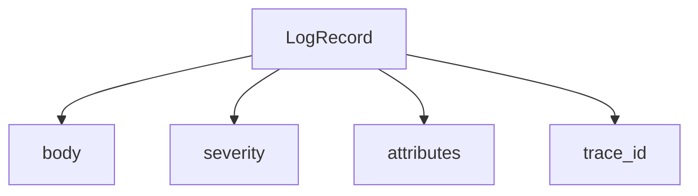

# Log Record

## What It Is
A **LogRecord** is a single, structured log entry in OpenTelemetry: timestamp, severity, body, attributes, and optional trace linkage.

## Why It Exists
Standardizing log structure lets logs flow through the same Collector/OTLP pipeline as traces and metrics, and correlate with them.

## Fields
| Field | Meaning |
|-------|---------|
| `timestamp` / `observed_timestamp` | When it happened / was seen |
| `severity_text` / `severity_number` | e.g., "ERROR" / 17 |
| `body` | The message |
| `attributes` | Structured key-values |
| `trace_id` / `span_id` | Correlation (optional) |
| `resource` | Originating resource |

## Architecture


## When to Use It
- Emit via OTel Log SDK for new code
- Bridge existing logs (see [Bridging](bridging.md))

## Code Example (Go)
```go
logger := otel.GetLoggerProvider().Logger("my-logger")
logger.Emit(ctx, log.Record{
    Body:     log.StringValue("order failed"),
    Severity: log.SeverityError,
    Attributes: []log.KeyValue{{Key: "order.id", Value: log.IntValue(42)}},
})
```

## Best Practices
- Use structured `attributes` not string concatenation
- Attach `trace_id`/`span_id` when in a span
- Keep log volume bounded (sample noisy logs)

## Related Concepts
- [Log SDK](log-sdk.md)
- [Log Correlation](log-correlation.md)
- [Severity](severity.md)
