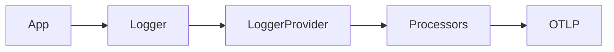

# Log SDK

## What It Is
The **Log SDK** provides the `Logger` API, batching, resource attachment, and processors for emitting log telemetry through OTLP.

## Why It Exists
A standard log SDK lets applications emit OTel-native logs that share the Resource/Context model with traces and metrics.

## Components
| Component | Role |
|-----------|------|
| `Logger` | Emit LogRecords |
| `LoggerProvider` | Configures processors/exporters |
| Processors | Batch, resource attach |
| Exporter | OTLP to Collector |

## Architecture


## When to Use It
- New code that emits structured logs natively
- When you want logs in the same pipeline as traces/metrics

## Code Example (config, Python)
```python
from opentelemetry.sdk._logs import LoggerProvider, LoggingHandler
from opentelemetry.exporter.otlp.proto.grpc._logs import OTLPLogExporter
provider = LoggerProvider()
provider.add_log_processor(BatchProcessor(OTLPLogExporter()))
```

## Best Practices
- Batch logs (don't export per-line)
- Attach Resource (service.name)
- Prefer bridging existing log libraries over rewriting

## Related Concepts
- [Bridging](bridging.md)
- [Log Appenders](log-appenders.md)
- [Collector](../06-collector/README.md)
