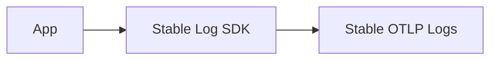

# Log Stability

## What It Is
The OpenTelemetry **Logs API/SDK reached Stability (GA)** — the log data model, OTLP logs, and the language log SDKs are now stable and backward-compatible.

## Why It Exists
Stability lets teams adopt OTel logs in production without fear of breaking changes to the data model or APIs.

## Stable Components
- LogRecord data model
- OTLP logs wire format
- Logger API / LoggerProvider
- Bridging handlers/appenders

## Architecture

## When to Use It
- Adopt OTel logs in production
- Build log pipelines alongside traces/metrics

## Best Practices
- Pin SDK versions; adopt stable appenders
- Validate with `debug` exporter
- Plan log volume/cost before full rollout

## Related Concepts
- [Stability Levels (core)](../01-core-concepts/stability-levels.md)
- [Bridging](bridging.md)
- [Version & Stability (docs)](../docs/version-stability.md)
