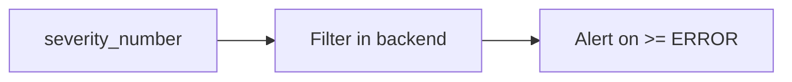

# Severity

## What It Is
**Severity** classifies a log's importance using a standardized numeric scale (TRACE=1 … FATAL=24), with optional `severity_text` labels.

## Why It Exists
A common severity scale lets backends filter and alert consistently across languages/frameworks that use different names (e.g., "ERR" vs "ERROR").

## Scale (subset)
| Number | Name |
|--------|------|
| 1–4 | TRACE1–4 |
| 5–8 | DEBUG1–4 |
| 9–12 | INFO1–4 |
| 13–16 | WARN1–4 |
| 17–20 | ERROR1–4 |
| 21–24 | FATAL1–4 |

## Architecture


## When to Use It
- Set severity correctly (don't log errors as INFO)
- Filter/noisily-sample by severity in Collector

## Code Example
```python
logger.error("db connection failed", extra={"db.system": "postgres"})
# severity_number = 17 (ERROR)
```

## Best Practices
- Map framework levels to the OTel scale
- Alert on ERROR/FATAL; sample DEBUG in prod
- Don't overuse ERROR for expected conditions

## Related Concepts
- [Log Record](log-record.md)
- [Bridging](bridging.md)
