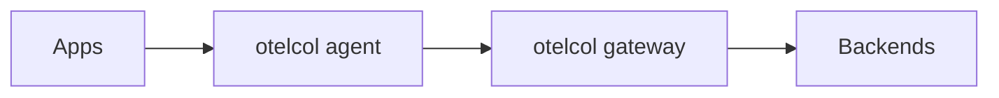

# 06 · Collector

> The **OpenTelemetry Collector** is the backbone of most deployments. Beyond the pipeline model (see Architecture), this section covers the binary/distributions, configuration, deep processor/exporter usage, scaling, and operating the Collector itself.

## Topics in this section

| Document | Summary |
|----------|---------|
| [otelcol.md](otelcol.md) | The Collector binary & what it does |
| [config.md](config.md) | YAML config structure |
| [distributions.md](distributions.md) | otelcol, otelcol-contrib, vendor builds |
| [processors-deep.md](processors-deep.md) | Advanced processor patterns |
| [exporters-deep.md](exporters-deep.md) | Production exporter patterns |
| [scaling.md](scaling.md) | Scaling & performance |
| [observability-of-collector.md](observability-of-collector.md) | Monitoring the Collector |
| [security.md](security.md) | TLS, auth, hardening |

See the [main README](../README.md) for the full map.
